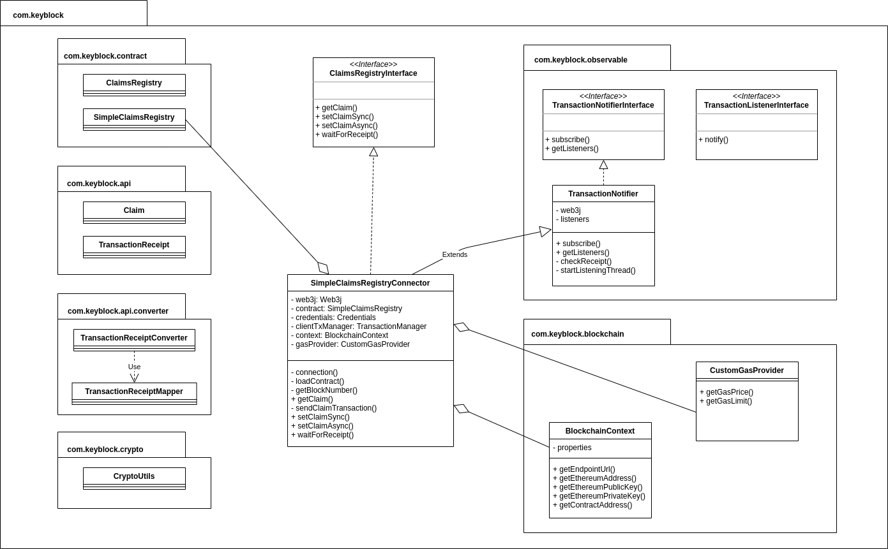

# Blockchain connector

Client Java pour accéder au smart contract ClaimsRegistry et SSOSession sur Ethereum

## Smart contracts

- `ClaimsRegistry` : smart contract de gestion des claims.
Il permet de gérer une liste de claims (clé -> valeur) pour un utilisateur.

```solidity
    struct Claim {
        address subject;
        address issuer;
        uint issuedAt;
        bytes issuerSignature;
        string key;
        string value;
    }
```


- `SSOSession` : smart contract de gestion des sessions SSO.
Il permet de gérer des sessions partagées pour un utilisateur entre plusieurs systèmes.

```solidity
    struct Session {
        string sessionId;
        address subject;
        address issuer;
        uint issuanceDate;
        uint endValidityDate;
        bytes signature;
    }
```

## Fichiers

- `resources/` : ABI et code compilé des smart contract, générés avec web3j depuis les fichiers .sol du projet racine

## Compte Ethereum pour l'IAM

Attention, comptes de test sur Ropsten uniquement :

**Seed :**

`suit blade rigid hat glue broccoli music blind scorpion column yard now`

**Compte 1 :**
- Adresse : 0x41f6B225846863E3C037e92F229cD40f5d575258
- Clé privée : 85d4fc54c9c6de275f5b0ac1a975657ed95d3959cdb97edc9da953bf1a75c723
- https://ropsten.etherscan.io/address/0x41f6b225846863e3c037e92f229cd40f5d575258

**Compte 2 :**
- Adresse : 0x5Db6617D5A8BB274379cD815D765722aF5088F8a
- Clé privée : 6484e4896a53883b15451347df3bd63a8e9b935310e194cd162fa64159086b07
- https://ropsten.etherscan.io/address/0x5Db6617D5A8BB274379cD815D765722aF5088F8a

## Fonctionnement général

#### Description

Les smart contracts sont déployés sur la blockchain. Des objets `SSOSessionConnector` et `ClaimRegistryConnector` ont été créés pour interagir avec eux.

Les interfaces `SSOSessionInterface` et `ClaimRegistryInterface` documentent les méthodes disponibles sur ces objets.

Ils doivent être initialisés avec :
- l'URL du endpoint RPC de la blockchain à laquelle se connecter
- L'adresse du smart contract
- L'adresse utilisée par l'entité qui va les appeler
- La clé privée associée à cette adresse

Pour créer un objet de type `SSOSession` ou `Claim`, il suffit de créer un objet contenant les données désirées et de le passer en paramètre au service concerné.

L'`issuer` et la `signature` seront automatiquement mis à jour ou calculés avant l'envoi.

#### Paramètres

Ethereum / Ropsten :
- URL de la blockchain avec Infura : https://ropsten.infura.io/v3/e6293df88f0a4648ad7624dad8822a98
- Adresse de SSOSession : 0x05603AFa90048DAEB8Bd52933bC60F58E3ba1b3A
- Adresse de ClaimsRegistry : 0xaDe68eCf6F1bC7A4374B58FdFC4DF29Ebc7b26e6 

Polygon / Mumbai :
- URL de la blockchain : https://rpc-mumbai.maticvigil.com/
- Adresse de SSOSession : 0x209144decd2b3a0a2bc943baa29d3b28e221bfdf

Avalanche / Fuji :
- URL de la blockchain : https://api.avax-test.network/ext/bc/C/rpc
- Adresse de SSOSession : 0x2166338F208E97003e3844E5A0C4DB11E7509383

## Utilisation

#### Import

`mvn install` et récupérer le jar `blockchain-connector-1.0-SNAPSHOT.jar` dans `target`, et l'importer dans le projet.

Il a besoin de 2 dépendances : `log4j-core` et `org.web3j`.

pom.xml:
```
    <dependencies>
        <dependency>
            <groupId>org.apache.logging.log4j</groupId>
            <artifactId>log4j-core</artifactId>
            <version>2.14.1</version>
        </dependency>
        <dependency>
            <groupId>org.web3j</groupId>
            <artifactId>core</artifactId>
            <version>4.8.4</version>
        </dependency>        
        <dependency>
            <groupId>com.keyblock</groupId>
            <artifactId>blockchain-connector</artifactId>
            <version>1.0</version>
            <scope>system</scope>
            <systemPath>${basedir}/lib/blockchain-connector-1.0-SNAPSHOT.jar</systemPath>
        </dependency>
    </dependencies>
```

### ClaimRegistry

#### Initialisation

```java
ClaimsRegistryConnector claimsRegistry = new ClaimsRegistryConnector(
        blockchainRpcEndpoint
        ,smartContractAddress
        ,serverEthereumAddress
        ,serverEthereumPrivateKey
);
```

#### Lecture d'une claim

```java
Claim claim = claimsRegistry.getClaim(subjectEthereumAddress, claimId);
```

#### Écriture d'une claim (synchrone)

```java

// Send transaction and wait for receipt. Blocking until transaction is validated
TxReceipt txReceipt = claimsRegistry.setClaimSync(subjectEthereumAddress, claimId, claimValue);
```

#### Écriture d'une claim (asynchrone)

```java

// Send transaction and get transaction hash, non-blocking.
String txHash = claimsRegistry.setClaimAsync(subjectEthereumAddress, claimId, claimValue);

// Then wait for transaction validation and receipt return, blocking but not mandatory
TxReceipt txReceipt = claimsRegistry.waitForReceipt(txHash);
```

#### Écriture asynchrone avec listener

On va d'abord créer la claim de façon asynchrone :
```
String txHash = registry.setClaimAsync(subjectAddress, claimId, claimValue);
```

Puis on va pouvoir créer un objet listener qui va s'abonner à la notification de validation. Il sera notifié lorsque le receipt sera obtenu, il va alors le récupérer et pourra effectuer ce qu'il y a à faire dans ce cas.
```
public class MyTransactionListener implements TransactionListenerInterface {
    
    @Override
    public void notify(TransactionReceipt transactionReceipt) {
        // do some stuff with tx receipt
    }

}

```

Subscribe:
```
MyTransactionListener listener = new MyTransactionListener(registry);

String txHash = registry.setClaimAsync(subjectAddress, claimId, claimValue);
registry.subscribe(txHash, listener);
```

### SSOSession

#### Initialisation

```java
SSOSessionConnector ssoSessionConnector = new SSOSessionConnector(
        blockchainRpcEndpoint
        ,smartContractAddress
        ,serverEthereumAddress
        ,serverEthereumPrivateKey
);
```

#### Lecture d'une session

```java
SSOSession ssoSessionConnector = contract.getSession(subjectEthereumAddress);
```

#### Écriture d'une session (synchrone)

Création d'une session

```java
// Create session object
SSOSession session = new SSOSession();
session.setSessionId(sessionId); // session id to generate (UUID ...)
session.setSubjectAddress(subjectAddress);
session.setEndValidityDateTimestamp(endValidityTimestamp);

// Session will be sign, then sent
TxReceipt receipt = ssoSessionConnector.createSessionSync(session);
```

Révocation d'une session
```java
TxReceipt receipt = ssoSessionConnector.revokeSessionSync(subjectAddress);
```

#### Écriture d'une session (asynchrone)
Création d'une session
```java

SSOSession session = new SSOSession();
session.setSessionId(sessionId);
session.setSubjectAddress(subjectAddress);
session.setEndValidityDateTimestamp(endValidityTimestamp);

// non blocking
String txHash = ssoSessionConnector.createSessionAsync(session);

// optional, blocking
TxReceipt txReceipt = ssoSessionConnector.waitForReceipt(txHash);
```

Révocation d'une session
```java
String txHash = ssoSessionConnector.revokeSessionAsync(subjectEthereumAddress);

TxReceipt txReceipt = ssoSessionConnector.waitForReceipt(txHash);
```


## Classes

https://app.diagrams.net/#G18hVQeigNhCrb1AxOr9Zugvekhz-dv02j

