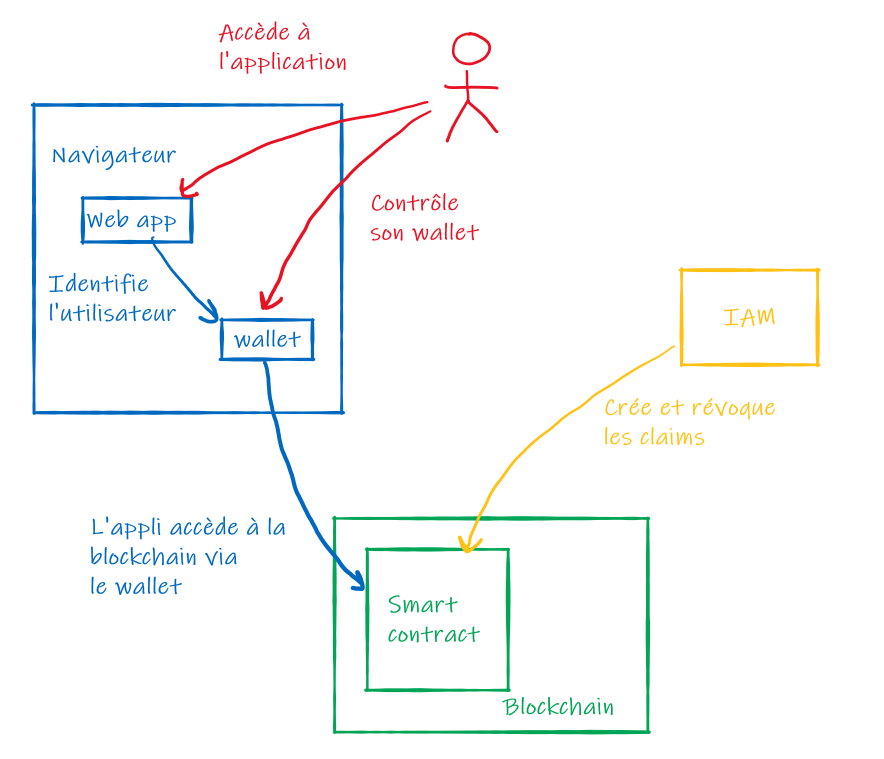

# Keyblock

Utilisation de Keycloak dans la gestion décentralisée des identités.

Objectif : les actions d'identification et d'authentification doivent rester entre les mains de l'utilisateur. 

Les ID providers **ne** doivent **pas** être au centre des opérations en 
- étant appelés à chaque accès à une ressource protégée
- détenant l'ensemble des informations de l'utilisateur dans un provider central à un système

Ainsi, la gestion de l'identité se retrouve décentralisée.

Pour cela, l'utilisateur gère un portefeuille de credentials. Il est alimenté par divers providers de confiance, chacun ne détenant qu'une partie de ses informations personnelles. Ils interviennent uniquement pour les opérations de création/modification/suppression de credential. 

Le reste du temps, ces credentials sont hébergés sur un registre de confiance et seul l'utilisateur a accès à ce qui le concerne.

2 concepts mis en jeu :
- **Verifiable Credentials** : l'émetteur d'un credential est connu et de confiance. Les credentials qu'il émet sont rigoureusement identifiés comme venant de lui et non altérés depuis leur création.
- **Preuve à divulgation nulle de connaissance** (ZKP) : les crédentials servent à prouver un fait (ex: l'utilisateur est admin) sans donner l'information à l'origine du fait (ex: l'utilisateur est admin parce qu'il appartient à tel ou tel groupe d'utilisateurs)

Nous allons mettre en place un exemple d'une telle organisation avec la blockchain Ethereum comme registre de confiance et Keycloak comme ID provider.

## Résumé

Premier exemple simple : une application veut savoir si donner ou non un accès admin à un utilisateur.

D'un côté, un IAM (Keycloak) connait un utilisateur sous son login/pwd habituel et sait s'il est paramétré admin ou non.

D'un autre côté, une application web qui identifie ses utilisateurs via leur identité Ethereum (adresse publique) contenue dans le wallet (Metamask) du navigateur.

Au milieu, un smart contract (ClaimHolder) de gestion des crédentials (Claims). L'application s'appuie sur ces crédentials pour savoir si un utilisateur est admin ou pas.

L'utilisateur dispose d'une interface web qui liste les claims lui appartenant et qui existent dans le smart contract. Cette interface connaît l'ensemble des claims qu'il est possible d'avoir ainsi que leurs trusted providers. 

L'utilisateur peut demander une nouvelle claim. Une requête est alors envoyée au provider, qui va effectuer une identification avec les credentials qu'il connait pour l'utilisateur puis va générer la claim correspondant et la signer avec sa clé privée Ethereum. Même scénario pour une modification ou suppression de claim.

De cette façon, l'utilisateur se constitue un portefeuille de claims. Quand il se connecte à l'application web, elle peut vérifier les claims et lui accorder les services correspondant à ses droits.

## Extrapolation du besoin

### #1

Considérons un consortium regroupant plusieurs entreprises ou organisation différentes ayant un objectif business commun sans pour autant être 100% en collaboration les unes avec les autres.

D'une part, elles ont besoin de partager un système d'informations commun pour atteindre leur but, donc de faire cohabiter les identités numériques de leurs utilisateurs dans un même système.

D'autre part, elles souhaitent conserver le secret sur leur organisation interne vis-à-vis des autres.

La solution mise en place par ce poc permet de faire cohabiter dans un tel systeme des informations sur les utilisateurs ouvrant droit à certains privilèges, sans devoir se baser de façon transparente sur les paramétrages internes.

### #2

Autre exemple, considérons des particuliers, utilisateurs indépendants de certains services.

Les fournisseurs de services nécessitent de connaître certaines informations sur ces utilisateurs pour fournir le service attendu.

Ces informations sont réparties dans différentes sources, chacun gérant les données propre à son périmètre.

Les utilisateurs souhaite que leurs données restent le moins regroupés et le plus protégé possible.

La solution mise en place par ce poc permet de répondre à ces besoins en amenant aux fournisseurs de services les données strictement nécessaires sans regrouper ni divulguer plus qu'il n'en faut.

### #3

En complément du #2, on peut imaginer un système ou l'utilisateur possède ses credentials et que lorsqu'un service souhaite accéder à une donnée, il doivent payer l'utilisateur pour y accéder.

Certains credentials peuvent être identifiés comme nécessaires pour accéder à un service et rester gratuit à l'usage. D'autres peuvent être utilisés à des fins de marketing ciblé ou autres pratiques commerciales et n'être mise à disposition que par son propriétaire et contre rémunération.

Un token (exemple: ERC-20) peut alors être adossé à la blockchain contenant les credentials pour remplir cette fonction.

## Composants

- smart contract ClaimRegistry
- application de gestion des claims (Node.js + Fwk front, Web3.js dist version + Metamask)
- application que l'utilisateur veut utiliser (Node.js + Fwk front, Web3.js dist version + Metamask)
- ID provider (Keycloak)
- Module de connexion avec la blockchain pour l'ID provider (avec [web3J](http://web3j.io/))

(Pour simplifier, les 2 applications web peuvent être une seule et même application, avec 2 pages ou 2 zones différentes)

## Step 1 (initialisation)
- [X] Page web minimaliste avec web3
- [X] Connexion / identification avec Metamask
- [X] Authentification avec Metamask par signature de données et vérification (avec [eth.personal, sign et ecRecover](https://web3js.readthedocs.io/en/v1.3.4/web3-eth-personal.html#sign))

## Step 2 (smart contract)
- [X] Smart contract ClaimHolder (alimentation des claims manuellement pour le moment)
- [ ] Paramétrer dans l'appli les claims possibles et leurs fournisseurs de confiance
- [X] Lecture des claims dans le smart contract depuis l'interface de gestion
- [ ] L'application affiche les claims de l'utilisateur et indique celles qu'il n'a pas

## Step 3 (provider)
- [ ] Mettre en place un IAM (keycloak ?)
- [X] Créer une identité Ethereum pour IAM
- [ ] Gérer les secrets dans un secret manager 
- [X] Initialiser un connecteur blockchain pour l'IAM
- [X] Mapper le connecteur sur chaque fonction du smart contract 
- [X] Création des claims par l'IAM
- [ ] Révocation des claims par l'IAM  
- [ ] Vérification de la signature de la claim par l'appli web

## Step 4 (amélioration)
- [ ] IHM plus belle pour présentation plus visuelle
- [ ] Rapprocher le smart contract des standards ERC-735 et ERC-780
- [ ] Plusieurs keycloak ou ID providers
- [ ] Vérifier la compliance zero knowledge proof et verifiable credential
- [ ] L'appli web demande l'accès à une claim, l'utilisateur l'accorde ou non
- [ ] Demande de génération de claim avec authent IAM depuis l'appli web
- [X] Rendre l'authent Metamask compatible avec [EIP-712](https://eips.ethereum.org/EIPS/eip-712)
- [ ] Vérfier l'authent via ecrecover de Solidity dans le smart contract
- [ ] Chaque émetteur publie un manifeste de ses claims (format, valeurs, utilité ...)

# Technique

## Fichiers

`contracts/` répertoire des smart contracts
- `ClaimsRegistry` smart contract principale
- `SimpleClaimsRegistry` version simplifiée de `ClaimsRegistry` sans gestion des signatures
- `compile.sh` compile les contrats, génère les ABI et les binaires et les copie dans le [blockchain-connector]https://github.com/ineat/keyblock/tree/master/java/blockchain-connector  
- `build` répertoire output de `compile.sh`
---
`webapp/` application web visitée par l'utilisateur
- `index.html` la page web qui affiche l'application
- `index.js` fichier node.js qui sert index.html sur http://localhost:3000
- `lib/web3.min.js` framework web3.js pour la version embarquée
- `lib/blockchain.js` fonctions d'accès à la blockchain pour la webapp
- `lib/bundles/` modules Node.js packagés pour navigateur
    - ethSigUtil.js : `browserify main.js --standalone sigUtil > ethSigUtil.js`
---
- `java/blockchain-connector` connecteur à la blockchain pour l'IAM
---
- [Archivé] `truffle/` anciennes versions des smart contracts gérés avec Truffle

## Run

### Client

Installer [Metamask](https://metamask.io) sur le navigateur.

(Pas besoin d'Ether côté client)

### Serveur (web app)

`npm install`

`node src/index.js` lance l'application sur http://localhost:3000 dans le navigateur équipé de Metamask

### Serveur IAM

## Choix techniques

### ERC-734 vs ERC-780

[ERC-735, Claim Holder](https://github.com/ethereum/EIPs/issues/735) et [ERC-780, Claim Registry](https://github.com/ethereum/EIPs/issues/780) sont deux propositions de standards assez similaires proposés pour gérer un ensemble de claims.
Pour le moment, aucun des deux n'a été validé officiellement pas la communauté.

ERC-735 va identifier les claims via un ID unique pour chaque. Il va également nécessiter une signature de l'issuer pour chaque claim.

ERC-780 va plutôt identifier les claims avec un tuple adresse de l'issuer, adresse du subject, key. Le concept de signature n'est pas géré.

Dans notre exemple, nous allons nous éloigner de ces deux standards car nous allons gérer les claims par le tuple adresse du subject/key. L'adresse de l'issuer ne servira que pour identifier l'émetteur de confiance et le vérifier au moyen de la clé publique et la signature. Nous allons donc mixer ces deux propositions de standards et gérer pour chaque claims : issuer, subject, signature, key, value.

### Méthode de signature

#### Côté web app

`web3.eth.sign / eth_sign` : n'affiche pas le message de façon intelligible. Quoi que l'on demande de signer, c'est affiché en hexa à l'utilisateur. Il ne sait donc pas ce qu'il signe.

`eth_signTypedData_v4` : OK, mais techniquement difficile de vérifier en mode browser. 
C'est la meilleure solution, basée sur ERC-712, afin de rendre l'utilisateur conscient de ce qu'il signe et éviter de lui faire signer des transactions non voulues. Mais attention à la vérification de la signature qui nécessite une manipulation technique hasardeuse tant que le standard n'est pas implémenté de base dans web3 ou les interface RPC.

`web3.eth.personal.sign` : OK, bonne solution côté client pour signer et vérifier. (La doc réclame de passer la clé privée, mais en réalité si on ne la passe pas, Metamask s'active pour demander la signature).

`web3.eth.accounts.sign `: nécessite de passer la clé privée directement. Nous ne la possédons pas, l'utilisateur doit donc la donner manuellement. C'est techniquement compliqué et très peu sécurisé.

#### Côté IAM

L'IAM doit signer les claims qu'il émet. Il peut se baser sur `eth_sign` et exploiter sa clé privée depuis un vault. Attention à la vérification, certains clients Ethereum préfixent et hashent les données avant de les faire signer, il faut savoir ce qu'on doit vérifier.

Une méthode de vérification peut être placée dans le smart contract avec `ecrecover` mais nécessite en amont de savoir découper la clé ECDSA et d'avoir la bonne donnée en entrée.

Création de claim :
- créer la claim avec les champs suivants : adresse de l'émetteur, adresse du destinataire, clé, valeur
- création d'un message à signer par concaténation : issuerAddress+subjectAddress+key+value
- hashage du message en SHA3 (keccak256) pour obtenir une longueur fixe de 32 octets  
- signature avec `eth_sign` (via infura ? via une API ? noeud local ?)
  - implicitement `eth_sign` modifie le message de cette façon : "\x19Ethereum Signed Message:\n" + message.length (soit 32) + message
- appel de `setClaim(address subject, string calldata key, string calldata value, bytes memory signature)` du smart contract
- le smart contract reconstitue la claim, le message de signature, le hash préfixé et recover l'adresse
- si l'adresse retrouvée correspond à `msg.sender`, la création de claim est validée
- la signature est enregistrée dans la claim

Lecture de la claim :
- le client récupère la claim avec `getClaim(address subject, string calldata key)`
- création d'un message à signer par concaténation : issuerAddress+subjectAddress+key+value
- signature avec `eth_sign`
- vérification
  - 1) comparaison de la signature obtenue et de la signature stockée, elles doivent être identiques 
  - 2) comparaison de l'adresse de l'emetteur avec celle obtenue par appel à `function recoverSigner(bytes32 message, bytes memory sig)`

## Docs

#### Ethereum
- https://eth.wiki/json-rpc/API

#### Signature
- https://ethereum.stackexchange.com/questions/90680/metamask-display-for-signing-data-with-eth-signtypeddata-v4
- https://docs.metamask.io/guide/signing-data.html#sign-typed-data-v4
- https://medium.com/metamask/scaling-web3-with-signtypeddata-91d6efc8b290
- https://eips.ethereum.org/EIPS/eip-712
- https://medium.com/metamask/eip712-is-coming-what-to-expect-and-how-to-use-it-bb92fd1a7a26
- https://www.codementor.io/@yosriady/signing-and-verifying-ethereum-signatures-vhe8ro3h6
- https://docs.soliditylang.org/en/latest/solidity-by-example.html?highlight=sign#creating-the-signature

#### We3j
- http://web3j.io/
- http://docs.web3j.io/latest/quickstart/

