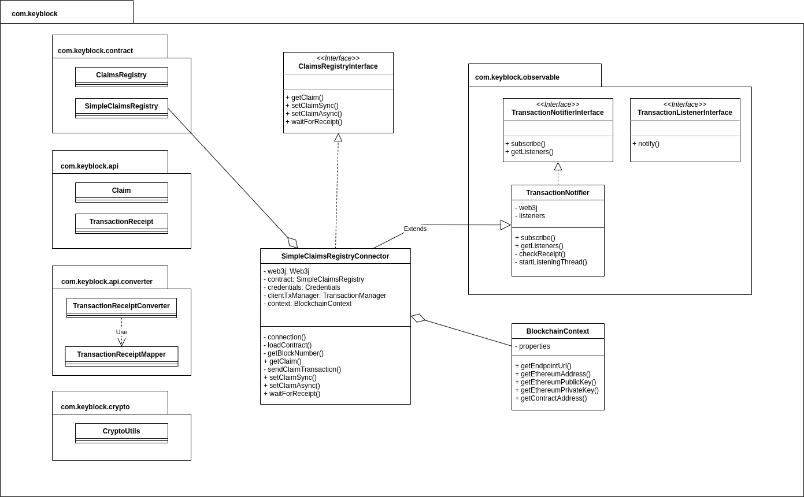

# Blockchain connector

Client Java pour accéder au smart contract ClaimsRegistry sur Ethereum

## Smart contracts

- `ClaimsRegistry` : smart contract de gestion des claims.
- `SimpleClaimsRegistry` : version simplifiée de `ClaimsRegistry` sans gestion des signatures.

## Fichiers

- `resources/` : ABI et code compilé des smart contract, générés avec web3j depuis les fichiers .sol du projet racine
- `resources/properties` : différents jeux de properties définissant des contextes de connexions différents (ethereum provider, adresse du smart contract ...)

## Compte Ethereum pour l'IAM

Attention, comptes de test sur Ropsten uniquement :

**Seed :**

`suit blade rigid hat glue broccoli music blind scorpion column yard now`

**Compte 1 :**
- Adresse : 0x41f6B225846863E3C037e92F229cD40f5d575258
- Clé privée : 85d4fc54c9c6de275f5b0ac1a975657ed95d3959cdb97edc9da953bf1a75c723
- https://ropsten.etherscan.io/address/0x41f6b225846863e3c037e92f229cd40f5d575258

**Compte 2 :**
- Adresse : 0x5Db6617D5A8BB274379cD815D765722aF5088F8a
- Clé privée : 6484e4896a53883b15451347df3bd63a8e9b935310e194cd162fa64159086b07
- https://ropsten.etherscan.io/address/0x5Db6617D5A8BB274379cD815D765722aF5088F8a

## Utilisation

#### Import

Importer le jar `blockchain-connector-1.0-SNAPSHOT.jar` dans le projet

pom.xml:
```
    <dependencies>
        <dependency>
            <groupId>org.apache.logging.log4j</groupId>
            <artifactId>log4j-core</artifactId>
            <version>2.14.1</version>
        </dependency>
        <dependency>
            <groupId>org.web3j</groupId>
            <artifactId>core</artifactId>
            <version>4.8.4</version>
        </dependency>        
        <dependency>
            <groupId>com.keyblock</groupId>
            <artifactId>blockchain-connector</artifactId>
            <version>1.0</version>
            <scope>system</scope>
            <systemPath>${basedir}/lib/blockchain-connector-1.0-SNAPSHOT.jar</systemPath>
        </dependency>
    </dependencies>
```
#### Configuration

Créer un fichier `.properties` avec les éléments suivants :

```properties
endpoint.url=<URL du endpoint RPC>
ethereum.address=<adresse Ethereum à utiliser pour les appels>
ethereum.publicKey=<clé publique de l'adresse Ethereum, peut être laissé vide, sera calculé depuis la clé privée>
ethereum.privateKey=<clé privée de l'adresse Ethereum>
contract.address=<adresse du smart contract>
```

#### Connexion

```
BlockchainContext context = new BlockchainContext("src/main/resources/properties/blockchain-connector.properties");
SimpleClaimsRegistryConnector registry = new SimpleClaimsRegistryConnector(context);
```

#### Contextes disponibles

(Définis dans les fichiers properties, exploités par `Context.ContextFlavor`)

- `SIMPLECLAIMREGISTRY_INFURA_ROPSTEN` Contrat SimpleClaimRegistry sur Ropsten via Infura.
- `SIMPLECLAIMREGISTRY_GANACHE` Contrat SimpleClaimRegistry en local avec Ganache.
- `CLAIMREGISTRY_INFURA_ROPSTEN` Contrat ClaimRegistry sur Ropsten via Infura.
- `SIMPLECLAIMREGISTRY_GANACHE` Contrat ClaimRegistry en local avec Ganache.

On peut soit utiliser un de ces contextes prédéfinis en créant un `new BlockchainContext(BlockchainContext.ContextFlavor.<context prédéfini>))`, soit utiliser un fichier properties personnalisé avec un `new BlockchainContext('properties/file/path')`

#### Lecture
```
String subjectAddress = "0x...";
String claimId = "isadmin";

Claim claim = registry.getClaim(subjectAddress, claimId);
```

#### Ecriture synchrone

Exécution bloquante tant que la transaction n'a pas été validée.

```
TransactionReceipt txReceipt  = registry.setClaimSync(subjectAddress, claimId, claimValue);
```
#### Ecriture asynchrone avec wait bloquant optionnel

2 étapes :
- 1. La transaction est créée et envoyée sur le réseau, sa validation est en attente, non bloquante. On récupère le hash de la transaction
- 2. Avec le hash, on attent le receipt (le "compte-rendu" de validation de la tx, qui indique qu'elle a été validée). L'appel au wait est alors bloquant en attendant le receipt.

```
String txHash = registry.setClaimAsync(subjectAddress, claimId, claimValue);
TransactionReceipt txReceipt = registry.waitForReceipt(txHash);
```

#### Ecriture asynchrone avec listener

On va d'abord créer la claim de façon asynchrone : 
```
String txHash = registry.setClaimAsync(subjectAddress, claimId, claimValue);
```

Puis on va pouvoir créer un objet listener qui va s'abonner à la notification de validation. Il sera notifié lorsque le receipt sera obtenu, il va alors le récupérer et pourra effectuer ce qu'il y a à faire dans ce cas.
```
public class MyTransactionListener implements TransactionListenerInterface {
    
    @Override
    public void notify(TransactionReceipt transactionReceipt) {
        // do some stuff with tx receipt
    }

}

```

Subscribe: 
```
MyTransactionListener listener = new MyTransactionListener(registry);

String txHash = registry.setClaimAsync(subjectAddress, claimId, claimValue);
registry.subscribe(txHash, listener);

```

## Classes

https://app.diagrams.net/#G18hVQeigNhCrb1AxOr9Zugvekhz-dv02j

