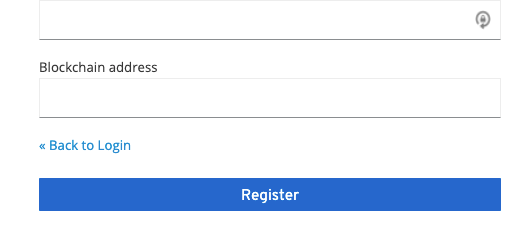

# Keyblock extensions

Those extensions aim to demonstrate some Proof of Concepts about decentralized authentications in the Ethereum blockchain. 

## Prerequisites

- A Keycloak (tested on v15) installation
- An Ethereum account on a test network
- A metamask browser plugin installed (if not, Keycloak will show you an error with a download link ;))

## How to build and deploy

Run `mvn clean package` and copy the generated jar into your Keycloak `deployment` directory

## Keyblock theme

- Provide an overridden registration page with a new form field :a `ethereum address id` field
- **For now, this theme also ship some web resources needed by the authenticators**

### Setup

- After the jar deployment, you should be able to set the keyblock theme in the Administration console
- Activate the `User Registration`

### Usage

- Go to the Keycloak login page and switch to the Registration page. You will see the new `Blockchain address` 
registration field.

## Keycloak Wallet Authenticator

You must configure a forked `Browser Flow` in order to add the `Wallet Blockchain Authenticator` execution

- this execution can be unique in the flow to provide a single authentication way
- you can **configure** the execution thanks to the `Config` link
  - to activate the SSO feature, toggle the corresponding option in the configuration of the execution. 
  
    The authenticator should create a decentralized session into the Ethereum blockchain based on the `SSOSessionConnector` helper
- you can add this execution after the `Browser Forms` Flow to do 2FA with the `Wallet Blockchain Authenticator` 

## Keycloak SSO Authenticator

This authenticator act as a silent authenticator (like the Cookie authenticator) to provide an SSO mechanism based on the ethereum blockchain.
This authenticator works with the `Keycloak Wallet Authenticator`. You must activate the SSO feature in this connector.

### First try: 

1. the authenticator get the user `eth_address` from the metamask wallet by using javascript through an html redirection
2. Once the `eth_address` is pickup, the authenticator try to get a session from the Ethereum blockchain
3. If an ethereum session is found, the authenticator try to get the user associated to this `eth_address`
4. If a user match, the keycloak session is created with the corresponding user

**Limitations**:

Because we use an HTML form to pick up the `eth_address` without validation or controls, anyone can inject an `eth_address` and try to steal a user session based on a non-Metamask identification.